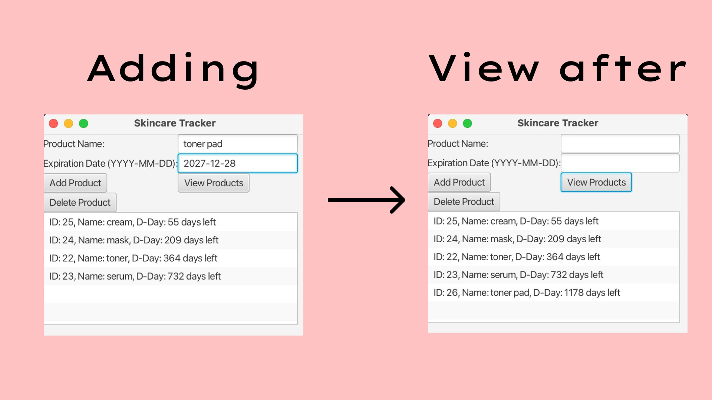
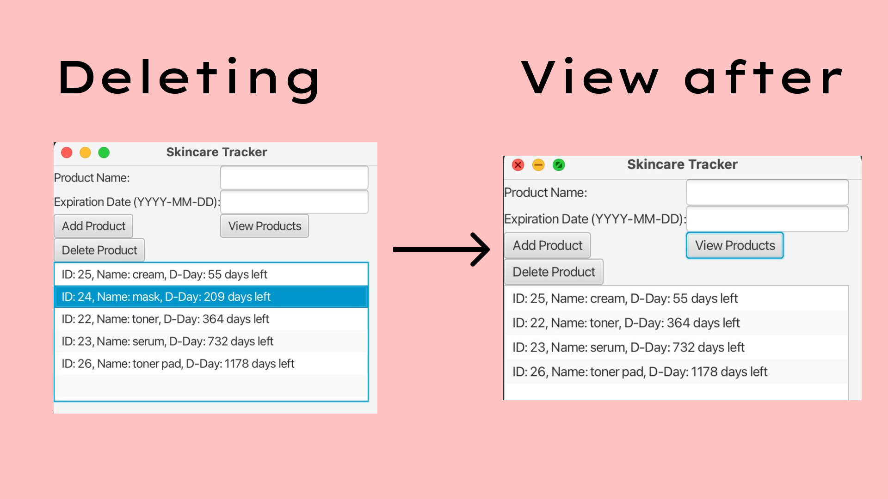

# Skincare Expiration Tracker


## Overview

Skincare Expiration Tracker is a JavaFX application that helps users manage their skincare products by tracking their expiration dates and categories. Users can add new products, view existing products, and delete products from their inventory. The application uses a SQLite database to store product information.
## Authors

- [@Aitmaliko](https://github.com/Aitmaliko)
  
## Table of Contents
- [Skincare Expiration Tracker](#skincare-expiration-tracker)
  - [Overview](#overview)
  - [Authors](#authors)
  - [Table of Contents](#table-of-contents)
  - [Features](#features)
  - [Tech Stack](#tech-stack)
  - [Prerequisites](#prerequisites)
  - [Getting Started](#getting-started)
  - [Clone the Repository](#clone-the-repository)
  - [Setup the Database](#setup-the-database)
  - [Compile and Run](#compile-and-run)
  - [Expected Output](#expected-output)
      - [Step 1: Add product](#step-1-add-product)
      - [Step 2: View after adding](#step-2-view-after-adding)
      - [Step 3: Delete product](#step-3-delete-product)
      - [Step 4: View after deleting](#step-4-view-after-deleting)
  - [Results](#results)
  - [Future Improvements](#future-improvements)
  - [Repository Structure](#repository-structure)
  -  [License](#license)
  - [Acknowledgements](#acknowledgements)
## Features

- **Add Product**: Easily add new skincare products with their name and expiration date.
- **View Products**: View a list of all skincare products stored in the database.
- **Delete Product**: Remove products from your inventory.
- **Database Connection**: Utilizes SQLite for storing product data, ensuring persistence across sessions.

## Tech Stack

- Java 17
- JavaFX
- SQLite (for database management)

## Prerequisites

To run this application, ensure you have the following installed:

- Java Development Kit (JDK) 11 or later
- SQLite JDBC Driver (download from [here](https://bitbucket.org/xerial/sqlite-jdbc/downloads/))
- JavaFX SDK (download from [here](https://gluonhq.com/products/javafx/))
  
## Getting Started

### Clone the Repository

```bash
git clone https://github.com/yourusername/SkincareExpirationTracker.git
cd SkincareExpirationTracker
```
## Setup the Database
Before running the application, ensure that the SQLite JDBC driver is correctly referenced in your project.

Create a SQLite database file named skincare.db in the root directory of the project.
The application will automatically create a products table if it doesn't exist.

## Compile and Run
```bash
javac -d out --module-path /Users/user/Downloads/javafx-sdk-23/lib --add-modules javafx.controls,javafx.fxml src/main/java/com/skincare/*.java

java --module-path /Users/user/Downloads/javafx-sdk-23/lib --add-modules javafx.controls,javafx.fxml -cp "out:/Users/user/Downloads/sqlite-jdbc-3.46.1.3.jar" com.skincare.SkincareApplication

```
## Expected Output
Upon launching the application, you will see the main interface with options to add, view, or delete skincare products.

#### Step 1: Add product 
Enter the product name and expiration date (YYYY-MM-DD), then click "Add Product."
#### Step 2: View after adding 
Click "View Products" to display all stored products.

  
  
#### Step 3: Delete product 
Choose the ID of the product you want to delete and confirm the deletion.
#### Step 4: View after deleting 
Click "View Products" to display all stored products.

  

## Results
### 1 
-If we assume that typical user tracks 10 products and, on average, 20% of those products expire before use, resulting in 2 expired products per user. The Skincare Tracker helps users monitor product expiration dates more effectively, reducing the number of expired products from 2 to 1, which is 50%.With timely tracking, users can save an estimated $20 per product by using them before expiration, leading to potential savings of up to $24,000 annually for 100 users.
### 2
-The Skincare Tracker helps cut waste by preventing expired products from being thrown away. For medication users, it also supports health and safety by ensuring products are used while still effective.

## Future Improvements
- While the application can be adapted for tracking medication expiration, handling the varied storage requirements for medications poses a challenge. Additional features would be necessary to accommodate these complexities.
- Implement user authentication to save and manage personal product lists.
- Add notifications to alert users when products are about to expire.
  
## Repository structure
```
├── src
│   ├── com
│   │   └── skincare
│   │       ├── DatabaseConnection.java          <- handles database connection
│   │       ├── Product.java                     <- product model
│   │       ├── ProductDAO.java                  <- data access object for products
│   │       └── SkincareApplication.java         <- main application class
│
├── assets
│   ├── Banner.png                               <- banner used in the README.
│   ├── adding.png                               <- expected output after adding procedure used in the README.
│   ├── deleting.png                             <- expected output after deleting procedure used in the README.
|
├── .gitignore                                   <- used to ignore certain folder and files that won't be commit to git.
│
├── LICENSE                                       <- license file.
│
├── README.md                                    <- this readme file.
```
## License
MIT License

Copyright (c) 2024 Malika Aitkozhayeva

Permission is hereby granted, free of charge, to any person obtaining a copy
of this software and associated documentation files (the "Software"), to deal
in the Software without restriction, including without limitation the rights
to use, copy, modify, merge, publish, distribute, sublicense, and/or sell
copies of the Software, and to permit persons to whom the Software is
furnished to do so, subject to the following conditions:

The above copyright notice and this permission notice shall be included in all
copies or substantial portions of the Software.

THE SOFTWARE IS PROVIDED "AS IS", WITHOUT WARRANTY OF ANY KIND, EXPRESS OR
IMPLIED, INCLUDING BUT NOT LIMITED TO THE WARRANTIES OF MERCHANTABILITY,
FITNESS FOR A PARTICULAR PURPOSE AND NONINFRINGEMENT. IN NO EVENT SHALL THE
AUTHORS OR COPYRIGHT HOLDERS BE LIABLE FOR ANY CLAIM, DAMAGES OR OTHER
LIABILITY, WHETHER IN AN ACTION OF CONTRACT, TORT OR OTHERWISE, ARISING FROM,
OUT OF OR IN CONNECTION WITH THE SOFTWARE OR THE USE OR OTHER DEALINGS IN THE
SOFTWARE.

## Acknowledgements
Thanks to the JavaFX community for their support.
Special thanks to SQLite for providing a reliable database solution.
